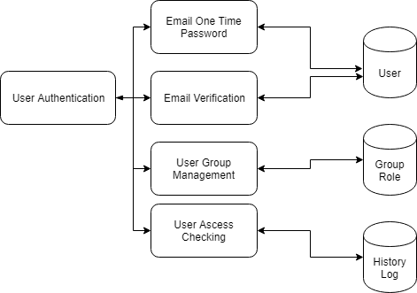
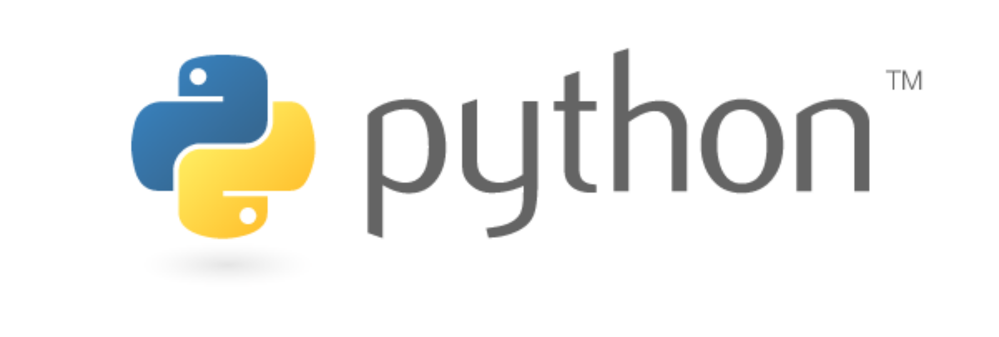

#  User Authentication SOP 
##  Introduction

&nbsp;&nbsp;&nbsp;&nbsp;&nbsp;&nbsp;&nbsp;&nbsp;📃 โครงงานนี้จะทำระบบ Microservices ที่เกี่ยวข้องกับระบบ Authentication เพื่อใช้เป็น Interface สำหรับการที่ Services อื่น ๆ นำระบบไปใช้ โดยการสร้างคลาสสำหรับเรียกข้อมูลของ Services นั้น ๆ เพื่อนำข้อมูลมาสร้างประเภทของผู้ใช้งาน ใน Services ที่ใช้บริการ Microservices ของพวกเรา ✅

##  Functions
&nbsp;&nbsp;&nbsp;&nbsp;&nbsp;&nbsp;&nbsp;&nbsp;👉 ในกระบวนการทำงานของระบบ Microservices ของพวกเรานั้นจะแบ่ง 2 องค์ประกอบหลัก ๆ คือ
	
  1. <b> ในส่วนของ User Authentication 🔑</b> จะเป็นการให้ผู้ใช้งานเข้าสู่ระบบ ผ่านการสมัครสมาชิกและมีการยืนยันตัวตนโดยการยืนยันตัวตนนั้นจะแบ่งกรณีออกเป็น 2 รูปแบบ ได้แก่ 
	
      1. <b> การยืนยันด้วย E-mail One-Time Password (OTP) 📠 </b>
	
      2. <b> การยืนยันด้วย E-mail Verification (การใช้ Url สำหรับการยืนยันตัวตน) 🌏 </b>

&nbsp;&nbsp;&nbsp;&nbsp;&nbsp;&nbsp;&nbsp;&nbsp;ในเบื้องต้นของโครงงานนั้นจะเป็นการใช้ E-mail สำหรับการเข้าถึงระบบก่อน 🎉

  2. <b> ในส่วนของ User Management 👨‍👨‍👧‍👧 &nbsp;</b> จะเป็นการจัดการผู้ใช้ในด้านต่าง ๆ โดยจะสามารถแบ่งการทำงานภายในได้ อีก 2 ส่วนย่อย ๆ คือ ส่วนของการจัดกลุ่มผู้ใช้งาน (User Group Management) และส่วนของการตรวจสอบการเข้าถึง (User Access Checking)
	
      1. <b> การจัดกลุ่มผู้ใช้งาน 📌 (User Group Management)</b> จะเป็นการจัดกลุ่มผู้ใช้งาน รวมถึงสิทธิ์ของผู้ใช้งาน (User Permissions) ว่าสามารถจัดการในส่วนไหนของ Services ที่นำในส่วนของพวกเราไปใช้
	
      2. <b> การตรวจสอบการเข้าถึง 🔒 (User Access Checking)</b> จะเป็นการตรวจสอบการเข้าถึงของผู้ใช้งาน เก็บประวัติของการใช้งานต่าง ๆ (User History Log) การเข้าถึงในส่วนไหนภายในระบบเป็นจำนวนบ่อยครั้ง รวมถึงแจ้งเตือนในกรณีการเข้าถึงที่ไม่พึงประสงค์ (User Anomalies Access)

##  Diagram
&nbsp;&nbsp;&nbsp;&nbsp;&nbsp;&nbsp;&nbsp;&nbsp;
 
&nbsp;&nbsp;&nbsp;&nbsp;<i>อ้างอิงจาก Aggregator Pattern เอกสาร Microservices Architecture TutorialsPoint</i>

##  Implementations

###  Languages

&nbsp;&nbsp;&nbsp;&nbsp;&nbsp;&nbsp;&nbsp;&nbsp;ในระบบ Microservices ของพวกเรา ถูกพัฒนาขึ้นโดยภาษา Python และเป็นโปรเจ็กต์แบบ Django 👍
 
 
&nbsp;&nbsp;&nbsp;&nbsp;&nbsp;&nbsp;&nbsp;&nbsp;

&nbsp;&nbsp;&nbsp;&nbsp;&nbsp;&nbsp;&nbsp;&nbsp;

###  Libraries
&nbsp;&nbsp;&nbsp;&nbsp;&nbsp;&nbsp;&nbsp;&nbsp;ในระบบ Microservices ของพวกเรา จะมีการใช้ Libraries ของ Django คือ Django Easy Audit

##  About Developer Team

&nbsp;&nbsp;&nbsp;&nbsp;&nbsp;&nbsp;&nbsp;&nbsp;นักศึกษาแขนงวิศวกรรมซอฟต์แวร์ กลุ่มที่ 1 โดยมีรายชื่อดังต่อไปนี้ 👇

| ชื่อ - นามสกุล | รหัสนักศึกษา |  รูปภาพ | รับผิดชอบในส่วนของ | 
| :--------: | :--------: | :--------: | :--------: |
|   ฐนกร ปานไทยกุล |   60070017   |       | E-mail One-Time Password |
|   ศตพล เกตุรัตนกุล   |   60070072   |       |  User Group Management |
|   ศุภกฤต อภิญญาณพงศ์   |   60070097   |       | Access Checking |
|   ไอศูรย์ ทิมศรี   |   60070121   |       | User E-mail Verification |

&nbsp;&nbsp;&nbsp;&nbsp;&nbsp;&nbsp;&nbsp;&nbsp;โครงงานนี้เป็นส่วนหนึ่งของวิชา Service-Oriented Programming (06016325) ชั้นปีที่ 3 ภาคการศึกษาที่ 1 ปีการศึกษา 2562 สาขาเทคโนโลยีสารสนเทศ คณะเทคโนโลยีสารสนเทศ สถาบันเทคโนโลยีพระจอมเกล้าเจ้าคุณทหารลาดกระบัง
