#  User Authentication SOP 
##  Introduction

&nbsp;&nbsp;&nbsp;&nbsp;&nbsp;&nbsp;&nbsp;&nbsp;📃 โครงงานนี้จะทำระบบ Microservices ที่เกี่ยวข้องกับระบบ Authentication เพื่อใช้เป็น Interface<br/> สำหรับการที่ Services อื่น ๆ นำระบบไปใช้ โดยการสร้างคลาสสำหรับเรียกข้อมูลของ Services นั้น ๆ<br/>  เพื่อนำข้อมูลมาสร้างประเภทของผู้ใช้งาน ใน Services ที่ใช้บริการ Microservices ของพวกเรา ✅

##  Functions
&nbsp;&nbsp;&nbsp;&nbsp;&nbsp;&nbsp;&nbsp;&nbsp;👉 ในกระบวนการทำงานของระบบ Microservices ของพวกเรานั้นจะแบ่ง 2 องค์ประกอบหลัก ๆ คือ
	
  1. <b> ในส่วนของ User Authentication 🔑</b> จะเป็นการให้ผู้ใช้งานเข้าสู่ระบบ ผ่านการสมัครสมาชิกและมี<br/> 
  การยืนยันตัวตนโดยการยืนยันตัวตนนั้นจะแบ่งกรณีออกเป็น 2 รูปแบบ ได้แก่ 
	
      1. <b> การยืนยันด้วย E-mail One-Time Password (OTP) 📠 </b>
	
      2. <b> การยืนยันด้วย E-mail Verification (การใช้ Url สำหรับการยืนยันตัวตน) 🌏 </b>

&nbsp;&nbsp;&nbsp;&nbsp;&nbsp;&nbsp;&nbsp;&nbsp;ในเบื้องต้นของโครงงานนั้นจะเป็นการใช้ E-mail สำหรับการเข้าถึงระบบก่อน 🎉

  2. <b> ในส่วนของ User Management 👨‍👨‍👧‍👧 &nbsp;</b> จะเป็นการจัดการผู้ใช้ในด้านต่าง ๆ โดยจะสามารถแบ่ง<br/> การทำงานภายในได้ อีก 2 ส่วนย่อย ๆ คือ ส่วนของการจัดกลุ่มผู้ใช้งาน (User Group Management)<br/>  และส่วนของการตรวจสอบการเข้าถึง (User Access Checking)
	
      1. <b> การจัดกลุ่มผู้ใช้งาน 📌 (User Group Management)</b> จะเป็นการจัดกลุ่มผู้ใช้งาน รวมถึง<br/> สิทธิ์ของผู้ใช้งาน (User Permissions) ว่าสามารถจัดการในส่วนไหนของ Services ที่นำใน<br />ส่วนของพวกเราไปใช้
	
      2. <b> การตรวจสอบการเข้าถึง 🔒 (User Access Checking)</b> จะเป็นการตรวจสอบการเข้าถึง<br/> ของผู้ใช้งาน เก็บประวัติของการใช้งานต่าง ๆ (User History Log) การเข้าถึงในส่วนไหน<br />ภายในระบบเป็นจำนวนบ่อยครั้ง รวมถึงแจ้งเตือนในกรณีการเข้าถึงที่ไม่พึงประสงค์<br /> (User Anomalies Access) ผ่านหน้า Admin ของ Django (Easy Audit)


##  Diagram
&nbsp;&nbsp;&nbsp;&nbsp;&nbsp;&nbsp;&nbsp;&nbsp;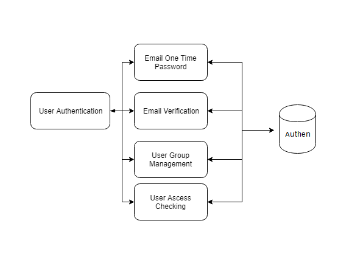
<br />
&nbsp;&nbsp;&nbsp;&nbsp;<i>อ้างอิงจาก Aggregator Pattern เอกสาร Microservices Architecture TutorialsPoint</i>
* หมายเหตุ : ตรง Database Icon ในที่นี้หมายถึง ตาราง ส่วน Database มี Schema เดียว คือ Authen 

##  Implementations

###  Languages

&nbsp;&nbsp;&nbsp;&nbsp;&nbsp;&nbsp;&nbsp;&nbsp;ในระบบ Microservices ของพวกเรา ถูกพัฒนาขึ้นโดยภาษา Python และเป็นโปรเจ็กต์แบบ Django 👍
<br />
<br />
&nbsp;&nbsp;&nbsp;&nbsp;&nbsp;&nbsp;&nbsp;&nbsp;

&nbsp;&nbsp;&nbsp;&nbsp;&nbsp;&nbsp;&nbsp;&nbsp;


###  Libraries
&nbsp;&nbsp;&nbsp;&nbsp;&nbsp;&nbsp;&nbsp;&nbsp;ในระบบ Microservices ของพวกเรา จะมีการใช้ Libraries ของ Django คือ Django Easy Audit และ PyJWT

##  Instructions

#### 🔑  1.) การเตรียมตัวก่อนใช้งานระบบ User Authentication 
&nbsp;&nbsp;&nbsp;&nbsp;&nbsp;&nbsp;&nbsp;&nbsp;กรณีไม่ได้ Deploy ขึ้น Server หรือใช้ Deploy ขึ้น Heroku แล้วใช้ Command

##### 🔑  (1.1) การติดตั้งเบื้องต้นก่อนใช้งานระบบ
ให้ทำการ Install Libraries ต่าง ๆ ผ่าน Python PIP อันประกอบด้วย
* MySQLClient (สำหรับบางเครื่องต้องติดตั้งผ่าน Wheel Files : .whl)
* Django Easy Audit 
* PyJWT
* Rest Framework

&nbsp;&nbsp;&nbsp;&nbsp;&nbsp;&nbsp;&nbsp;&nbsp;โดยในการพิมพ์คำสั่ง
```python
pip install <str:libraries-name>
``` 
&nbsp;&nbsp;&nbsp;&nbsp;&nbsp;&nbsp;&nbsp;&nbsp;
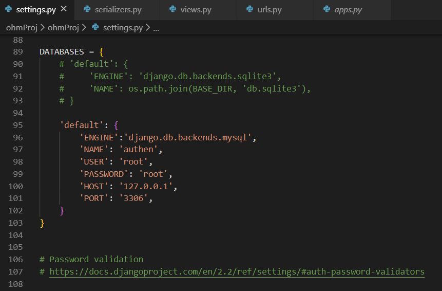

&nbsp;&nbsp;&nbsp;&nbsp;&nbsp;&nbsp;&nbsp;&nbsp;นอกจากนี้ต้องทำการ Set Up Database สำหรับบันทึกข้อมูลที่ใช้ในการทำกิจกรรมต่าง ๆ 
ภายในระบบ<br/>  User Authentication ในกรณีนี้ใช้เป็น MySQL Workbench บนเครื่องตัวเอง

##### 🔑  (1.2) การเปิดใช้งานระบบ
&nbsp;&nbsp;&nbsp;&nbsp;&nbsp;&nbsp;&nbsp;&nbsp;ให้ทำการพิมพ์คำสั่งดังต่อไปนี้ 
* กรณียังไม่ได้ย้ายไปในโฟลเดอร์ ให้พิมพ์ว่า 
```python
python "ohmProj/manage.py" runserver
```
&nbsp;&nbsp;&nbsp;&nbsp;&nbsp;&nbsp;&nbsp;&nbsp;หรือให้ทำการพิมพ์ 
```python
cd ohmProj 
```
&nbsp;&nbsp;&nbsp;&nbsp;&nbsp;&nbsp;&nbsp;&nbsp;จากนั้นแล้วพิมพ์ว่า 
```python
python "manage.py" runserver
```
* กรณีที่ย้ายเข้าไปในโฟลเดอร์แล้ว ให้พิมพ์ว่า 
```python
python "manage.py" runserver
```
#### 🔑 2.) การใช้งานของ ระบบ Authentication (แบบผู้ใช้ปรกติ – Normal User)

##### 🔑 (2.1) การสมัครสมาชิก
&nbsp;&nbsp;&nbsp;&nbsp;&nbsp;&nbsp;&nbsp;&nbsp;ให้ทำการเปิดเบราเซอร์แล้วเข้ามาที่ 
```
http://127.0.0.1:8080/micro/signup/
```
&nbsp;&nbsp;&nbsp;&nbsp;&nbsp;&nbsp;&nbsp;&nbsp;
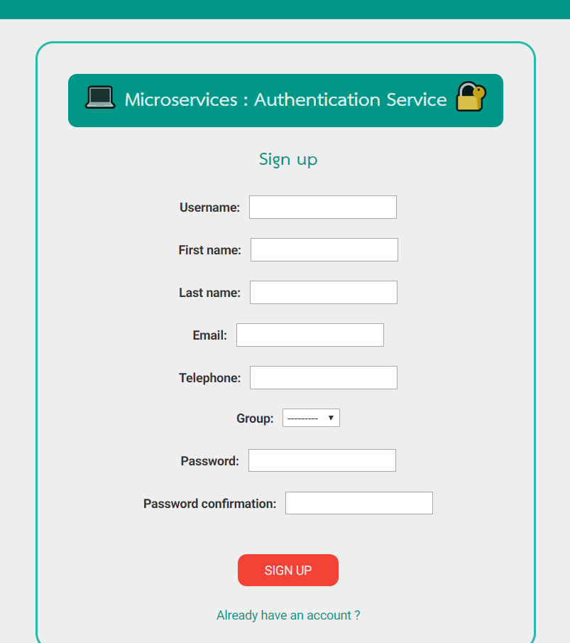

&nbsp;&nbsp;&nbsp;&nbsp;&nbsp;&nbsp;&nbsp;&nbsp;จากนั้นทำการกรอกข้อมูลลงไปในแบบฟอร์มของหน้าเว็บไซต์ที่ต้องการทำการสมัครสมาชิก

&nbsp;&nbsp;&nbsp;&nbsp;&nbsp;&nbsp;&nbsp;&nbsp;
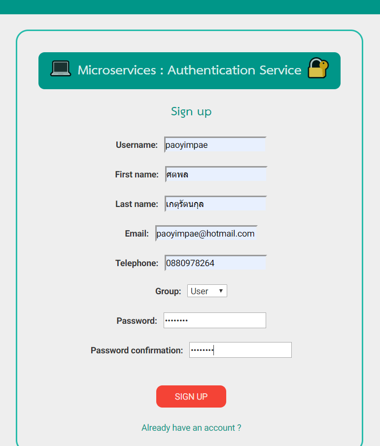

&nbsp;&nbsp;&nbsp;&nbsp;&nbsp;&nbsp;&nbsp;&nbsp;ในส่วนของ Group นั้น บุคคลที่จะสามารถแก้ไขได้ คือ Administrator เท่านั้น
จากนั้นให้ทำการกดปุ่ม<br/>  Sign Up เพื่อทำการสมัครสมาชิก

&nbsp;&nbsp;&nbsp;&nbsp;&nbsp;&nbsp;&nbsp;&nbsp;
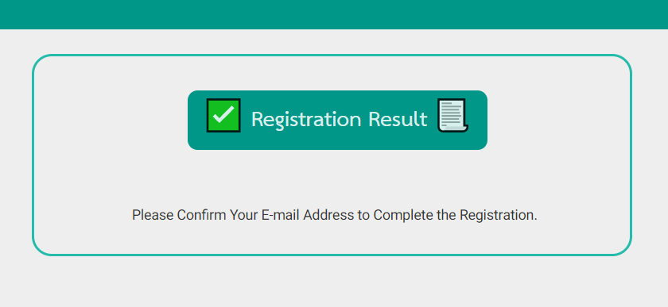
 
&nbsp;&nbsp;&nbsp;&nbsp;&nbsp;&nbsp;&nbsp;&nbsp;จากนั้นระบบก็จะทำการส่งข้อมูลให้ไปกดยืนยันในอีเมลล์

&nbsp;&nbsp;&nbsp;&nbsp;&nbsp;&nbsp;&nbsp;&nbsp;
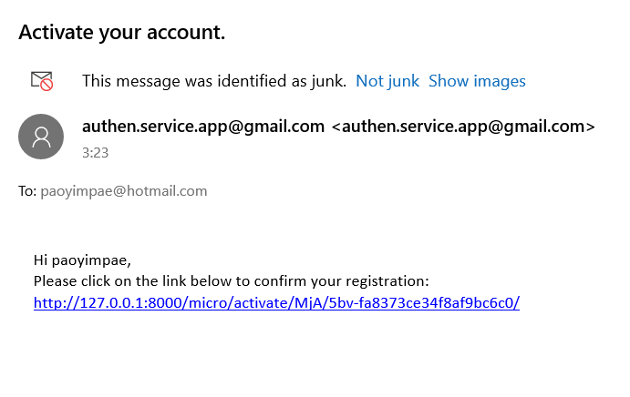

&nbsp;&nbsp;&nbsp;&nbsp;&nbsp;&nbsp;&nbsp;&nbsp;
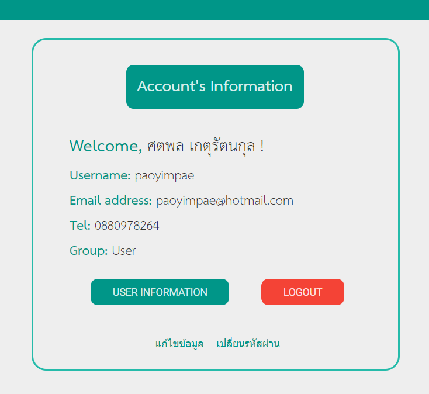

##### 🔑 (2.2) การเข้าสู่ระบบ
ให้ทำการเปิดเบราเซอร์แล้วเข้ามาที่ 
```
http://127.0.0.1:8080/micro/login/
```
&nbsp;&nbsp;&nbsp;&nbsp;&nbsp;&nbsp;&nbsp;&nbsp;
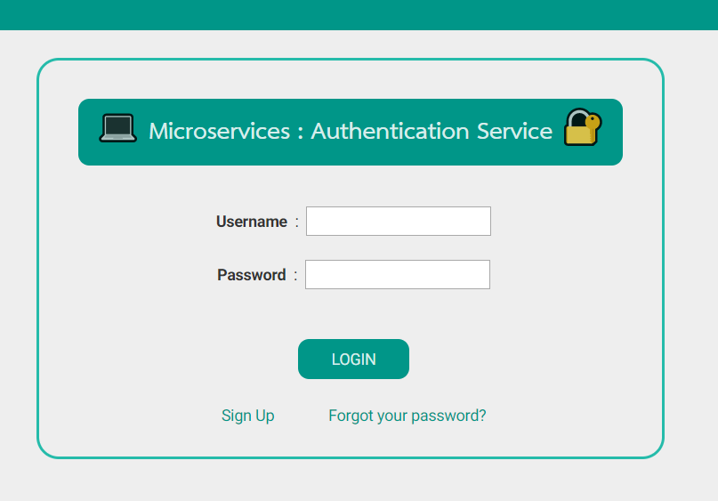

&nbsp;&nbsp;&nbsp;&nbsp;&nbsp;&nbsp;&nbsp;&nbsp;ทำการกรอกข้อมูลสมาชิกที่ต้องการเข้าสู่ระบบ

&nbsp;&nbsp;&nbsp;&nbsp;&nbsp;&nbsp;&nbsp;&nbsp;
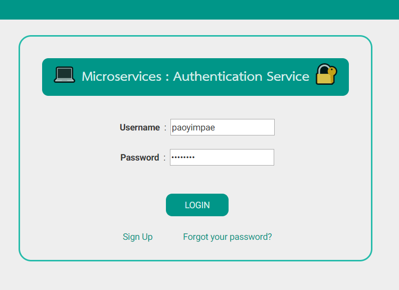

 
&nbsp;&nbsp;&nbsp;&nbsp;&nbsp;&nbsp;&nbsp;&nbsp;จากนั้นกด Log In

&nbsp;&nbsp;&nbsp;&nbsp;&nbsp;&nbsp;&nbsp;&nbsp;
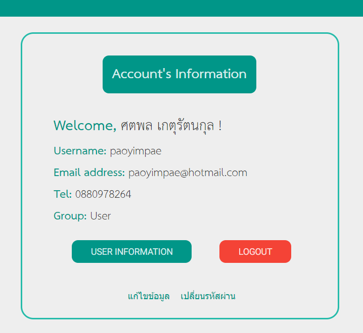

##### 🔑 (2.3) การแก้ไขข้อมูล
&nbsp;&nbsp;&nbsp;&nbsp;&nbsp;&nbsp;&nbsp;&nbsp;ให้ทำการเปิดเบราเซอร์แล้วเข้ามาที่ 
```
http://127.0.0.1:8080/micro/edit_profile/
```
&nbsp;&nbsp;&nbsp;&nbsp;&nbsp;&nbsp;&nbsp;&nbsp;หรือทำการคลิก แก้ไขข้อมูล จากหน้า Home

&nbsp;&nbsp;&nbsp;&nbsp;&nbsp;&nbsp;&nbsp;&nbsp;
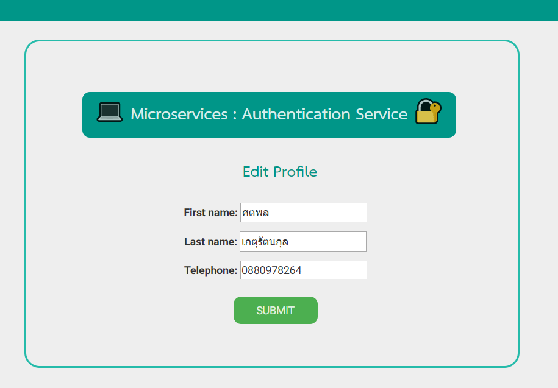

&nbsp;&nbsp;&nbsp;&nbsp;&nbsp;&nbsp;&nbsp;&nbsp;ทำการแก้ไขข้อมูลที่ต้องการแล้วกด Submit (ในกรณีนี้เปลี่ยนเบอร์โทรศัพท์)

&nbsp;&nbsp;&nbsp;&nbsp;&nbsp;&nbsp;&nbsp;&nbsp;
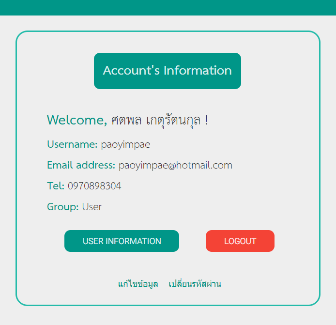

##### 🔑 (2.4) การเปลี่ยนรหัสผ่าน
&nbsp;&nbsp;&nbsp;&nbsp;&nbsp;&nbsp;&nbsp;&nbsp;ให้ทำการเปิดเบราเซอร์แล้วเข้ามาที่ 
```
http://127.0.0.1:8080/micro/password/ 
```
&nbsp;&nbsp;&nbsp;&nbsp;&nbsp;&nbsp;&nbsp;&nbsp;หรือทำการคลิก เปลี่ยนรหัสผ่าน จากหน้า Home

&nbsp;&nbsp;&nbsp;&nbsp;&nbsp;&nbsp;&nbsp;&nbsp;
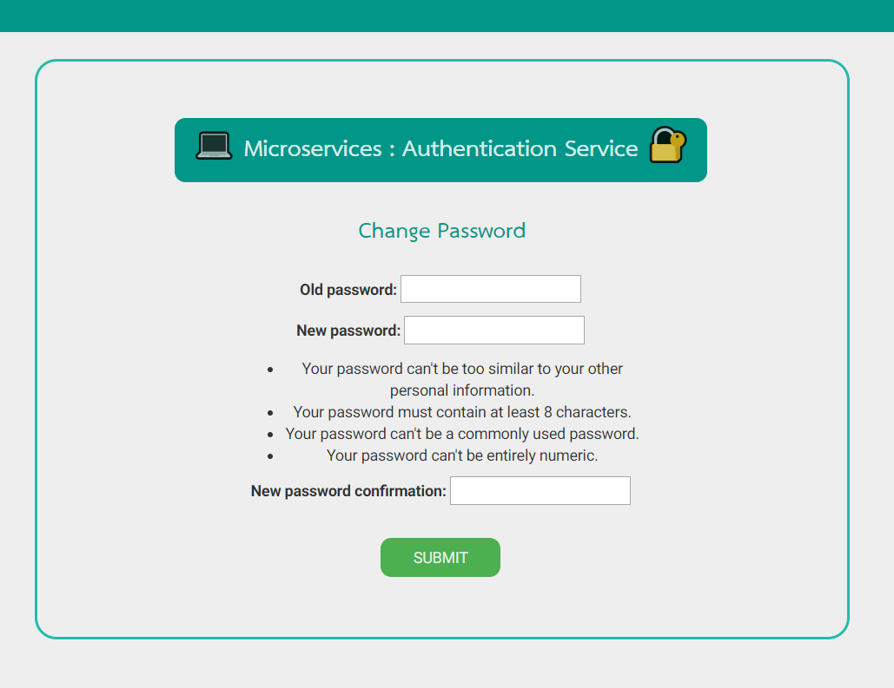
 
&nbsp;&nbsp;&nbsp;&nbsp;&nbsp;&nbsp;&nbsp;&nbsp;ให้ทำการกรอกรหัสผ่านเดิม และรหัสผ่านใหม่ที่ต้องการแล้วกดปุ่ม Submit

##### 🔑 (2.5) การนำข้อมูลไปใช้กับ Service ของคนอื่น ๆ (API : JSON Data)
&nbsp;&nbsp;&nbsp;&nbsp;&nbsp;&nbsp;&nbsp;&nbsp;ให้ทำการเปิดเบราเซอร์แล้วเข้ามาที่ 
```
http://127.0.0.1:8080/micro/user_detail/
```
&nbsp;&nbsp;&nbsp;&nbsp;&nbsp;&nbsp;&nbsp;&nbsp;หรือทำการคลิก User Information จากหน้า Home

&nbsp;&nbsp;&nbsp;&nbsp;&nbsp;&nbsp;&nbsp;&nbsp;
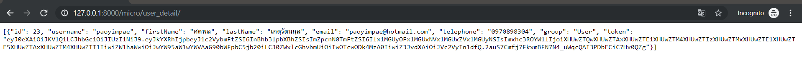

&nbsp;&nbsp;&nbsp;&nbsp;&nbsp;&nbsp;&nbsp;&nbsp;จะแสดงข้อมูลในรูปแบบของ JSON ออกมา โดยในส่วนของ Token  จะเป็น Token แบบ JSON Web Token<br/>
ซึ่งเป็นมาตรฐานในการใช้เชื่อมต่อกับ Service อื่น ๆ โดยในตัวอย่างนี้จะเป็นการเก็บข้อมูลเหล่านี้

&nbsp;&nbsp;&nbsp;&nbsp;&nbsp;&nbsp;&nbsp;&nbsp;
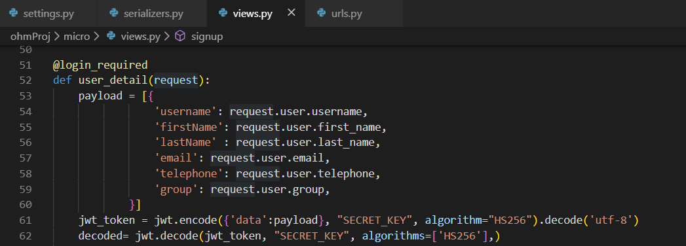
 
##### 🔑 (2.6) การ Reset รหัสผ่าน
&nbsp;&nbsp;&nbsp;&nbsp;&nbsp;&nbsp;&nbsp;&nbsp;ให้ทำการเปิดเบราเซอร์แล้วเข้ามาที่ 
```
http://127.0.0.1:8080/micro/password_reset/
```
&nbsp;&nbsp;&nbsp;&nbsp;&nbsp;&nbsp;&nbsp;&nbsp;หรือทำการคลิก Forgot Your Password ? จากหน้า Log In

&nbsp;&nbsp;&nbsp;&nbsp;&nbsp;&nbsp;&nbsp;&nbsp;
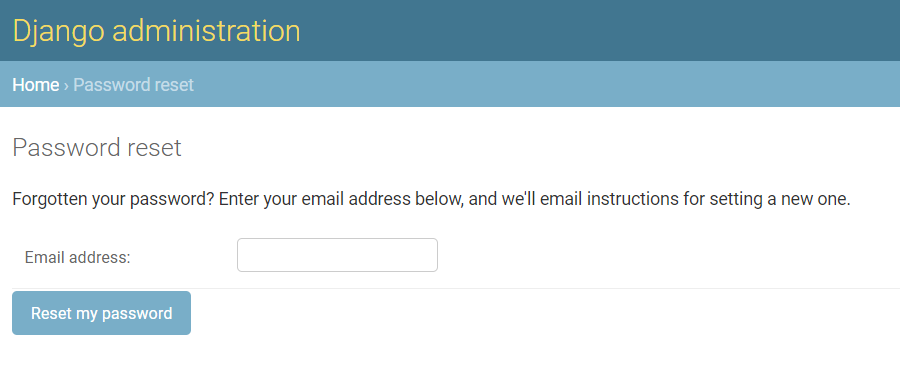

 
&nbsp;&nbsp;&nbsp;&nbsp;&nbsp;&nbsp;&nbsp;&nbsp;ให้ทำการใส่อีเมล์ที่จะใช้ในการรีเซตรหัสผ่าน จากนั้นกด Reset My Password

&nbsp;&nbsp;&nbsp;&nbsp;&nbsp;&nbsp;&nbsp;&nbsp;
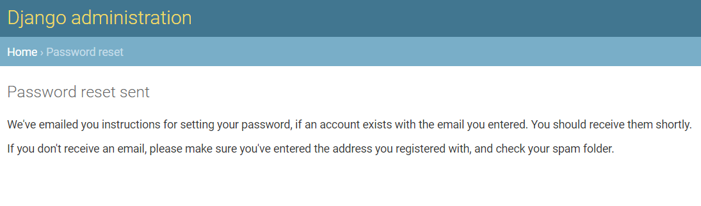


&nbsp;&nbsp;&nbsp;&nbsp;&nbsp;&nbsp;&nbsp;&nbsp;
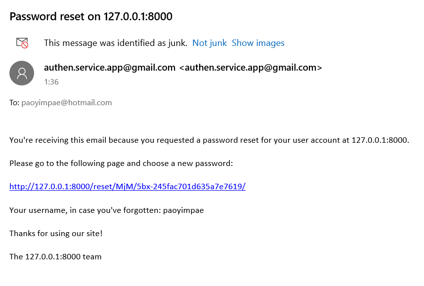

&nbsp;&nbsp;&nbsp;&nbsp;&nbsp;&nbsp;&nbsp;&nbsp;จากนั้นตรวจสอบอีเมล์และทำการกดเข้าไปในลิงค์ที่ได้รับ

&nbsp;&nbsp;&nbsp;&nbsp;&nbsp;&nbsp;&nbsp;&nbsp;
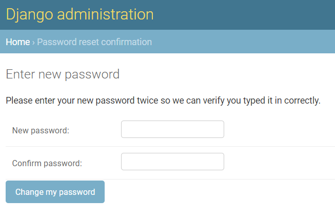

&nbsp;&nbsp;&nbsp;&nbsp;&nbsp;&nbsp;&nbsp;&nbsp;ให้ทำการใส่รหัสผ่านใหม่และยืนยันรหัสผ่าน จากนั้นกดปุ่ม Change My Password

#### 🔑 3.) การใช้งานของ ระบบ Authentication (แบบผู้จัดการ – Administrator User)

##### 🔑 (3.1) การใช้ Django Rest Framework (API : JSON Data)

###### 🔑 (3.1.1) การสมัครสมาชิก
&nbsp;&nbsp;&nbsp;&nbsp;&nbsp;&nbsp;&nbsp;&nbsp;ให้ทำการเปิดเบราเซอร์แล้วเข้ามาที่ 
```
http://127.0.0.1:8080/micro/api/user/create/
```
&nbsp;&nbsp;&nbsp;&nbsp;&nbsp;&nbsp;&nbsp;&nbsp;จากนั้นกรอกข้อมูลที่ต้องทำการสมัครสมาชิกและกด Post โดยการกำหนดรหัสผ่าน จะทำได้โดยการกด<br/> Reset Password ด้วยอีเมล์เท่านั้น (ย้อนกลับไปดูข้างบน) เนื่องจากไม่สามารถทำการ Password Hashing ได้ จึงทำให้<br/>ไม่สามารถบันทึกรหัสผ่านด้วย JSON ได้

&nbsp;&nbsp;&nbsp;&nbsp;&nbsp;&nbsp;&nbsp;&nbsp;

 
###### 🔑 (3.1.2) การตรวจสอบรายชื่อสมาชิกทั้งหมด
&nbsp;&nbsp;&nbsp;&nbsp;&nbsp;&nbsp;&nbsp;&nbsp;ให้ทำการเปิดเบราเซอร์แล้วเข้ามาที่ 
```
http://127.0.0.1:8080/micro/api/user/all/
```
&nbsp;&nbsp;&nbsp;&nbsp;&nbsp;&nbsp;&nbsp;&nbsp;
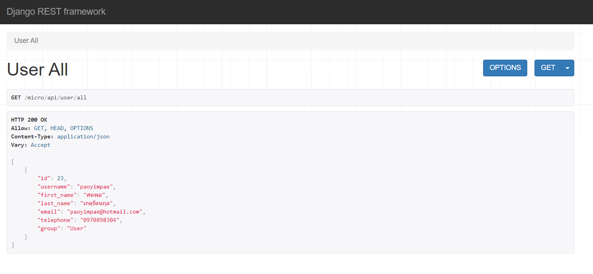

 
###### 🔑 (3.1.3) การตรวจสอบสมาชิกด้วย User ID
&nbsp;&nbsp;&nbsp;&nbsp;&nbsp;&nbsp;&nbsp;&nbsp;ให้ทำการเปิดเบราเซอร์แล้วเข้ามาที่ 
```
http://127.0.0.1:8080/micro/api/user/<int:user_id>/ 
```
&nbsp;&nbsp;&nbsp;&nbsp;&nbsp;&nbsp;&nbsp;&nbsp;
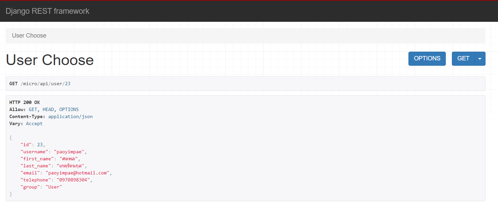

 
###### 🔑 (3.1.4) การทำการแก้ไขข้อมูลและลบข้อมูลสมาชิก
&nbsp;&nbsp;&nbsp;&nbsp;&nbsp;&nbsp;&nbsp;&nbsp;ให้ทำการเปิดเบราเซอร์แล้วเข้ามาที่ 
```
http://127.0.0.1:8080/micro/api/user/update/<int:user_id> 
```
&nbsp;&nbsp;&nbsp;&nbsp;&nbsp;&nbsp;&nbsp;&nbsp;จากนั้นกรอกข้อมูลที่ต้องทำการแก้ไขข้อมูล แล้วกดปุ่ม Post ด้านล่าง Form หรือทำการกดปุ่ม Delete เพื่อลบบัญชี

&nbsp;&nbsp;&nbsp;&nbsp;&nbsp;&nbsp;&nbsp;&nbsp;
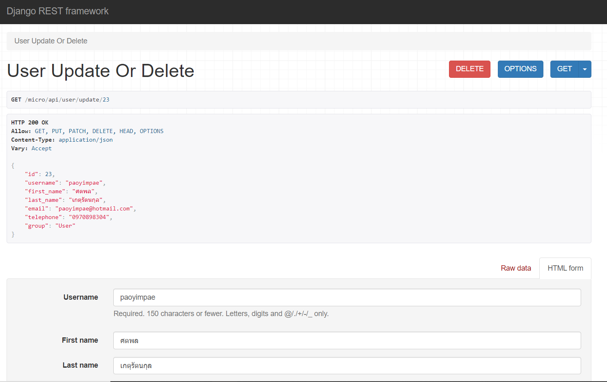

##### 🔑 (3.2) การจัดการสิทธิ์ของผู้ใช้งาน (Roles Management)
&nbsp;&nbsp;&nbsp;&nbsp;&nbsp;&nbsp;&nbsp;&nbsp;ให้ทำการมาเพิ่มข้อมูลผ่าน Database ที่ท่านใช้ ในกรณีใช้เป็น MySQL Workbench ก็สามารถสร้าง Role<br/> ได้ (ในตัวอย่างจะเป็น Admin Role และ User Role)

&nbsp;&nbsp;&nbsp;&nbsp;&nbsp;&nbsp;&nbsp;&nbsp;
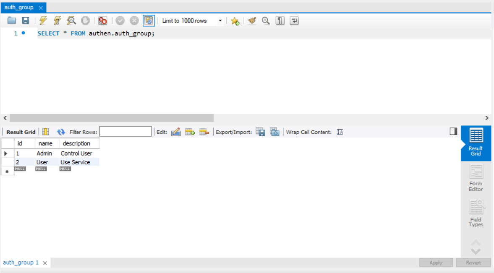
 
##### 🔑 (3.3) การเข้าใช้ในส่วนของ Audit (Log Checking)
&nbsp;&nbsp;&nbsp;&nbsp;&nbsp;&nbsp;&nbsp;&nbsp;ให้ทำการเปิดเบราเซอร์แล้วเข้ามาที่ 
```
http://127.0.0.1:8080/admin
```
&nbsp;&nbsp;&nbsp;&nbsp;&nbsp;&nbsp;&nbsp;&nbsp;(Login ด้วย Superuser เท่านั้น ปัจจุบัน Admin Role ยังไม่สามารถใช้งานได้จริง ให้ทำการสร้างโดยการรันคำสั่ง 
```python
python manage.py createsuperuser
```
&nbsp;&nbsp;&nbsp;&nbsp;&nbsp;&nbsp;&nbsp;&nbsp;จากนั้นกรอกข้อมูล และทำการรันคำสั่งเปิด Server ผ่าน
```python
python manage.py runserver
```
&nbsp;&nbsp;&nbsp;&nbsp;&nbsp;&nbsp;&nbsp;&nbsp;อีกครั้ง) แล้วทำการเลือกหัวข้อที่จะดู ได้แก่ CRUD / Login / Request (ในตัวอย่างจะเป็นการเข้าไปดู CRUD Logs)

&nbsp;&nbsp;&nbsp;&nbsp;&nbsp;&nbsp;&nbsp;&nbsp;
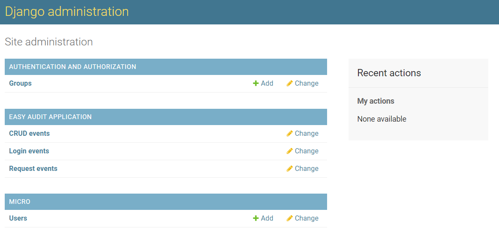

&nbsp;&nbsp;&nbsp;&nbsp;&nbsp;&nbsp;&nbsp;&nbsp;
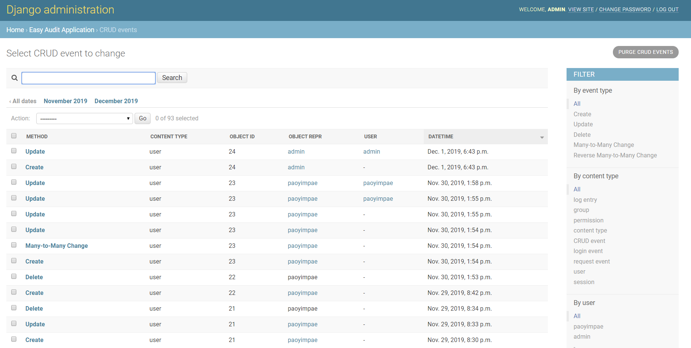

###### พวกผมคิดว่า Project อันนี้สามารถพัฒนาและต่อยอดไปประยุกต์ใช้ได้ในอนาคต

##  About Developer Team
&nbsp;&nbsp;&nbsp;&nbsp;&nbsp;&nbsp;&nbsp;&nbsp;นักศึกษาแขนงวิศวกรรมซอฟต์แวร์ กลุ่มที่ 1 โดยมีรายชื่อดังต่อไปนี้ 👇

| ชื่อ - นามสกุล | รหัสนักศึกษา |  รูปภาพ | รับผิดชอบในส่วนของ | 
| :--------: | :--------: | :--------: | :--------: |
|   ฐนกร ปานไทยกุล |   60070017   |       | E-mail Verification & OTP |
|   ศตพล เกตุรัตนกุล   |   60070072   |       |  Token, Front-End & Documents |
|   ศุภกฤต อภิญญาณพงศ์   |   60070097   |       | Access Checking |
|   ไอศูรย์ ทิมศรี   |   60070121   |       | Overview (Check All in System) |

&nbsp;&nbsp;&nbsp;&nbsp;&nbsp;&nbsp;&nbsp;&nbsp;โครงงานนี้เป็นส่วนหนึ่งของวิชา Service-Oriented Programming (06016325) <br/>ชั้นปีที่ 3 ภาคการศึกษาที่ 1 ปีการศึกษา 2562 สาขาเทคโนโลยีสารสนเทศ <br/>คณะเทคโนโลยีสารสนเทศ สถาบันเทคโนโลยีพระจอมเกล้าเจ้าคุณทหารลาดกระบัง
